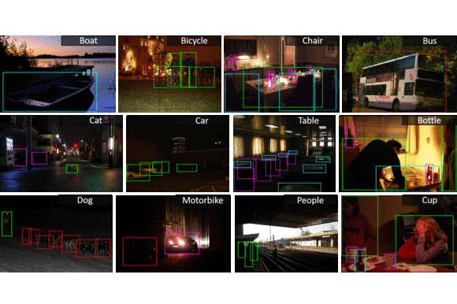
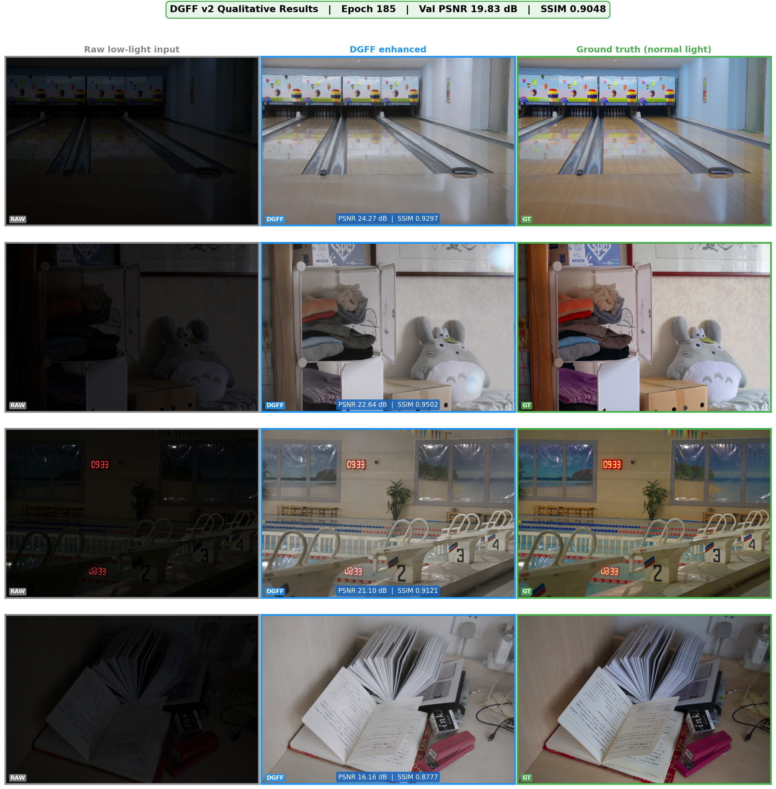
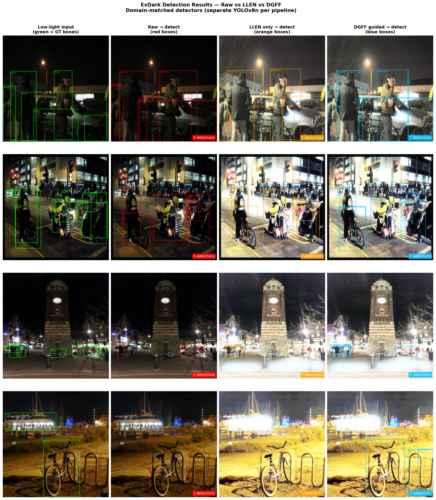
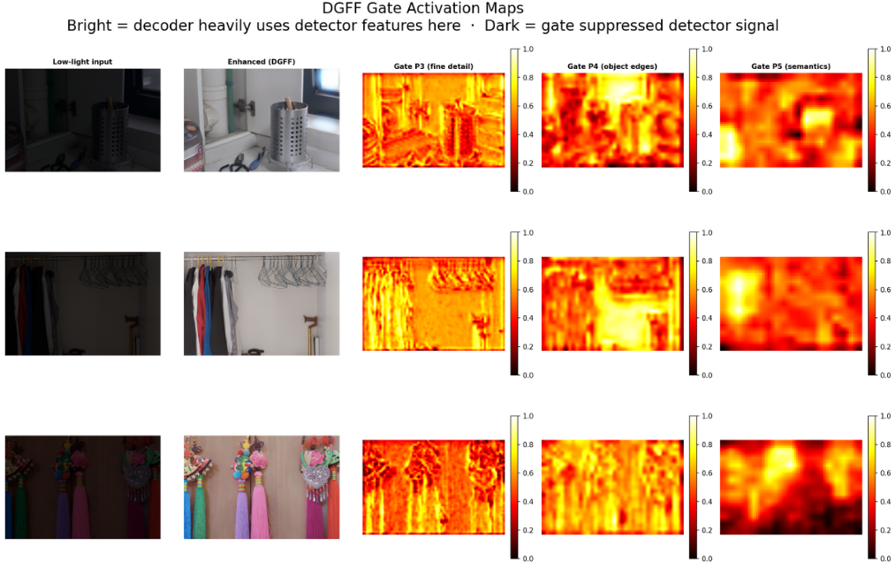

# DGFF: Detection-Guided Feature Feedback

> The detector teaches the enhancer what to preserve, and the gated adapters learn to pass only the useful lessons.

Official code for **"End-to-End Task-Oriented Low-Light Image Enhancement via Detection-Guided Feature Feedback"**, accepted at *The 4th International Conference on Computing Advancements (ICCA 2026)*, Dhaka, Bangladesh.


[](https://huggingface.co/abbaab/DGFF)
[](https://huggingface.co/datasets/abbaab/DGFF-dataset)

<p align="center">
  
</p>

**Quick links:** [Model weights (Hugging Face)](https://huggingface.co/abbaab/DGFF) | [Dataset (Hugging Face)](https://huggingface.co/datasets/abbaab/DGFF-dataset) | [Paper figures](Figures/)

---

## Overview

Low-light image enhancement (LLIE) networks are normally trained for pixel-level fidelity (PSNR/SSIM). Object detectors, however, rely on edges, fine texture and local gradients, which are exactly the cues that noise smoothing and illumination normalisation can erase.

**DGFF** closes this gap during training. Intermediate feature maps from a frozen **YOLOv8n** backbone (P3, P4, P5) are routed back into the decoder of a U-Net enhancer (**LLEN**) through lightweight **gated 1x1 adapters**, so reconstruction is shaped by what the detector finds discriminative.

- **Reverse feedback path:** live detector features guide enhancement decoder reconstruction (most prior work flows the other way, or only shares a loss).
- **Zero inference overhead:** the adapters (86,464 parameters) are discarded at test time. DGFF inference is the same forward pass as a plain LLEN, with identical latency.
- **No bounding boxes needed for the feedback loss:** the detection feature alignment loss compares backbone features, not box annotations.
- **Domain-matched evaluation:** a separate detector is trained on each pipeline's own image distribution (raw, LLEN-enhanced, DGFF-enhanced), removing the domain mismatch that penalises enhanced images in conventional protocols.

## Method at a glance

Training uses a two-pass forward process:

1. **Pass 1:** LLEN enhances the low-light input without guidance. The result goes through the frozen YOLOv8n backbone, which yields P3/P4/P5 feature maps.
2. **Pass 2:** those features pass through the gated adapters and are injected additively into decoder stages dec2 (P3), dec3 (P4) and dec4 (P5). dec1 receives no injection, to preserve fine spatial detail. All losses are computed on this guided output.

Each decoder stage computes:

```
d(l) = ResBlock( Conv1x1[ up(d(l-1)) || s_l ]  +  sigmoid(Conv1x1(F_l)) * ReLU(BN(Conv1x1(F_l))) )
```

Training objective:

```
L = L_L1 + 0.1 * L_perc + lambda_det(t) * L_det
```

- `L_perc`: VGG-16 perceptual loss on relu2_2 and relu3_3.
- `L_det`: L2 distance between YOLOv8 backbone features of the guided output and the clean reference at P3, P4, P5.
- `lambda_det` ramps linearly from 0 to 0.5 over the first 100 epochs.

| Component | Parameters |
|---|---|
| LLEN (U-Net, base channels 32) | 4,844,803 |
| DGFF adapters (training only) | 86,464 |
| YOLOv8n backbone (frozen, first 10 layers) | 1,272,656 |

### Training schedule

| Phase | Data | What is trained | Details |
|---|---|---|---|
| 1 | LOL (485 train pairs) | LLEN + adapters | 200 epochs, Adam, lr 1e-4 cosine-annealed to 1e-6, batch 4, 256x256 crops + horizontal flip. Best checkpoint at epoch 185 |
| 2 | ExDark train (2,999 images) | Adapters only (LLEN frozen) | 20 epochs, lr 1e-5, self-consistency `L_det` (no paired references available) |
| 3 | ExDark test (2,563 images) | Three YOLOv8n detectors | Raw, LLEN-enhanced and DGFF-enhanced, 50 epochs each, evaluated on matching test images |

## Results

### Enhancement quality (LOL validation)

| Method | PSNR (dB) | SSIM |
|---|---|---|
| RetinexNet | 16.77 | 0.460 |
| Zero-DCE | 14.86 | 0.589 |
| Zero-DCE++ | 18.06 | 0.823 |
| EnlightenGAN | 17.48 | 0.650 |
| **DGFF (ours)** | **19.83** | **0.9048** |

Retinexformer (27.18 dB, transformer-based) is a reference point only; it is higher-capacity and not task-aware.

### Detection on ExDark (domain-matched, YOLOv8n)

| Pipeline | mAP@0.5 | mAP@0.5:0.95 |
|---|---|---|
| Raw (baseline) | 0.408 | 0.232 |
| LLEN only | 0.469 | 0.276 |
| **DGFF (ours)** | **0.474** | **0.280** |

DGFF improves over the unenhanced baseline by 6.6 points and over LLEN-only by 0.5 points. DGFF beats the raw baseline on all 12 classes and leads LLEN-only on 8 of 12.

> **Honest note on significance.** A paired bootstrap (2,000 resamples of the ExDark test images) gives a 95% CI of [-0.0065, 0.0112] on the DGFF vs LLEN-only difference, which includes zero (one-sided p ~ 0.30). The +0.5-point margin over LLEN-only is directionally consistent but **not statistically distinguishable from noise**. The gain over the raw baseline is clear. See `bootstrap_significance.py`.

### Inference cost (Apple M4, CPU)

| Pipeline | GFLOPs @640 | ms/img |
|---|---|---|
| Raw -> Detect | 8.86 | 11.9 (84.3 FPS) |
| LLEN-only -> Detect | 128.14 | 121.1 (8.3 FPS) |
| DGFF -> Detect | 128.14 | 121.1 (8.3 FPS) |

<p align="center">
  
</p>

## Paper figures

All figures from the paper are in [`Figures/`](Figures/).

| Paper figure | File | Description |
|---|---|---|
| Fig. 1 | [`framework_diagram.pdf`](Figures/framework_diagram.pdf) | End-to-end DGFF framework (Phases 1-3) |
| Fig. 2 | [`dgff_v2_results_final.png`](Figures/dgff_v2_results_final.png) | Qualitative enhancement on LOL: low-light input, DGFF output, ground truth |
| Fig. 3 | [`exdark_detection_final.png`](Figures/exdark_detection_final.png) | ExDark detections: raw (GT boxes), LLEN-only, DGFF |
| Fig. 4 | [`gate_maps.png`](Figures/gate_maps.png) | Gate activation maps at P3 (fine detail), P4 (edges), P5 (semantics) |
| Fig. 5 | [`confusion_matrix_normalized.pdf`](Figures/confusion_matrix_normalized.pdf) | Normalised confusion matrix, DGFF-enhanced ExDark pipeline |

### Qualitative enhancement (LOL)

<p align="center">
  
</p>

### Detection on ExDark: raw vs LLEN-only vs DGFF

<p align="center">
  
</p>

### Learned gate activations

The gates respond differently across scenes despite identical weights, which indicates input-dependent routing rather than a fixed transformation: P3 follows high-frequency edges, P4 coarser object boundaries, and P5 smooth region-level semantics.

<p align="center">
  
</p>

## Repository layout

| Path | Description |
|---|---|
| `models.py` | Network definitions (LLEN, DGFF adapters, YOLOv8 feature extractor) |
| `dgff.py`, `dgff_v2.py`, `dgff_v3.py` | Training / pipeline scripts, successive versions |
| `DGFF_full.ipynb`, `DGFF_full_v1.ipynb`, `DGFF_full-v2.ipynb` | End-to-end notebooks, successive versions |
| `LOL_load.ipynb` | LOL dataset loading |
| `ablation_standalone.py`, `ablation_full200_lambda01.py` | `lambda_det` ablations (50-epoch sweep and full 200-epoch run) |
| `ablation_results.json`, `ablation_full200_lambda01.json` | Saved ablation outputs |
| `bootstrap_significance.py` | Paired image-resampling bootstrap for DGFF vs LLEN-only |
| `benchmark.py` | Params / GFLOPs / latency measurements |
| `diagnose.py`, `diagnose_per_class.py` | Detection diagnostics and per-class AP |
| `validate_checkpoints.py` | Checkpoint sanity checks |
| `mps_probe.py` | Apple MPS backend probe |
| `additional_revew_test.ipynb` | Additional review-stage experiments |
| `Figures/` | Figures used in the paper (framework diagram, qualitative results, detections, gate maps, confusion matrix) |
| `Exdark.gif`, `confusion_matrix_normalized.png` | Images shown in this README |

<!-- TODO: confirm which script/notebook is the canonical entry point (dgff_v3.py?) and mark the older versions as legacy. -->

## Getting started

### 1. Environment

```bash
git clone https://github.com/ShuvroSankar/DGFF.git
cd DGFF
python -m venv .venv && source .venv/bin/activate
pip install torch torchvision ultralytics numpy pillow scipy matplotlib tqdm
```

<!-- TODO: replace the line above with `pip install -r requirements.txt` once a requirements file is added. -->

The paper's experiments ran on an Apple M4 Mac Mini (16 GB), using the MPS backend for Phase 1 and CPU for YOLOv8 fine-tuning/evaluation. Phase 1 took about 7.6 hours and Phase 2 about 19 hours on that setup. CUDA GPUs should be considerably faster.

### 2. Pretrained weights

Model weights are hosted on Hugging Face: **[abbaab/DGFF](https://huggingface.co/abbaab/DGFF)**.

```bash
huggingface-cli download abbaab/DGFF --local-dir ./weights
```

<!-- TODO: list the checkpoint files in the model repo (e.g. LLEN best checkpoint from LOL epoch 185, adapter weights from ExDark fine-tuning) and how to load them. -->

At inference only LLEN is needed (the adapters are discarded): enhance the image, then run any detector.

### 3. Data

Datasets are available on Hugging Face: **[abbaab/DGFF-dataset](https://huggingface.co/datasets/abbaab/DGFF-dataset)** (see its dataset card for layout and licensing).

- **LOL:** 500 low/normal-light pairs, split 485 train / 15 validation.
- **ExDark:** 7,363 images, 12 classes, official `imageclasslist.txt` split: 2,999 train / 1,800 val / 2,563 test.

```bash
pip install -U huggingface_hub
huggingface-cli download abbaab/DGFF-dataset --repo-type dataset --local-dir ./data
```

The dataset repository is large (about 5.7 GB). Hugging Face may ask you to log in first.

### 4. Run

```bash
# Phase 1: LOL enhancement training (LLEN + adapters, 200 epochs)
# Phase 2: ExDark adapter fine-tuning (LLEN frozen, 20 epochs)
# Phase 3: domain-matched detector training and evaluation (raw / LLEN / DGFF)
python dgff_v3.py   # TODO: confirm entry point and arguments
```

Supporting analyses:

```bash
python bootstrap_significance.py   # DGFF vs LLEN-only significance
python benchmark.py                # params / FLOPs / latency
python diagnose_per_class.py       # per-class AP@0.5
```

<!-- TODO: add exact CLI arguments / config paths once finalised. -->

## Citation

If you use this code or data, please cite:

```bibtex
@inproceedings{sen2026dgff,
  title     = {End-to-End Task-Oriented Low-Light Image Enhancement via Detection-Guided Feature Feedback},
  author    = {Sen, Shuvro Sankar and Mia, MD. Maruf and Hasan, Naim and Chayon, Muhammad Hasibur Rashid},
  booktitle = {Proceedings of The 4th International Conference on Computing Advancements (ICCA 2026)},
  year      = {2026},
  address   = {Dhaka, Bangladesh},
  publisher = {ACM}
}
```

<!-- TODO: add the DOI once the ACM proceedings entry is live. -->

## Authors

- Shuvro Sankar Sen
- MD. Maruf Mia
- Naim Hasan
- Muhammad Hasibur Rashid Chayon

American International University - Bangladesh (AIUB), Dhaka, Bangladesh.

## Limitations and future work

- The ExDark gain of DGFF over LLEN-only (+0.5 pp) is not statistically significant; the benefit over the raw baseline is clear.
- Small-scale, heavily occluded or homogeneous-texture classes (Chair, Motorbike, People, Table) did not improve over LLEN-only.
- LOL is indoor and ExDark is mostly outdoor, which causes a domain gap (e.g. bicycle failure case in the paper).
- The LOL validation set has only 15 images, causing noisy epoch-to-epoch PSNR (about 2 dB), which affects short-schedule ablations.
- Planned: end-to-end joint training under a shared detection loss, cross-attention adapter injection, higher-resolution or multi-scale adapter feedback, and evaluation on video benchmarks and detectors beyond YOLOv8.

## License

Released under the [BSD-3-Clause License](LICENSE). The LOL and ExDark datasets and the YOLOv8 (Ultralytics) weights/code remain under their own licences and terms.

## Acknowledgements

Built on [Ultralytics YOLOv8](https://github.com/ultralytics/ultralytics), the [LOL dataset](https://daooshee.github.io/BMVC2018website/) (Wei et al., 2018) and the [ExDark dataset](https://github.com/cs-chan/Exclusively-Dark-Image-Dataset) (Loh and Chan, 2019).
